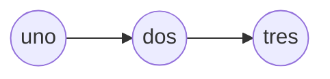
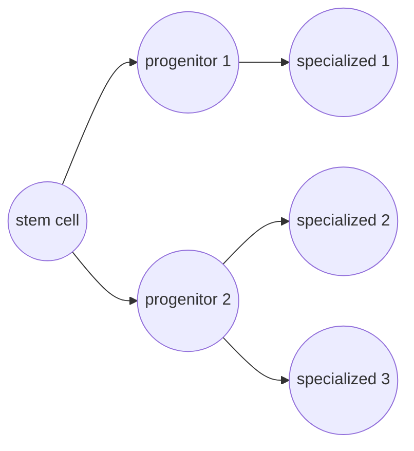

# sc-multi-omics

_memo for single cell multi-omics data and methods; this is a work in progress focusing on single-cell in single omics across different omics layers as well as multi-omics methods and applications, starting at laymen terms in the hopes of building up towards complex notions in the field_

> ✨ "fine.. I'll do it myself" - Thanos
<!-- 🔷🔴🟨🟢🟪🔶 -->

## Table of Contents

- [Context: sc-omics](#context-sc-omics)
- [Trajectory Inference](#trajectory-inference)
- [Multi-Omics Methodologies](#multi-omics-methodologies)

## Context: sc-omics

**Readings**:
- [x] [Single-cell sequencing techniques from individual to multiomics analyses](https://www.nature.com/articles/s12276-020-00499-2)
- [x] [The technological landscape and applications of single-cell multi-omics](https://www.nature.com/articles/s41580-023-00615-w)
- [x] [Considerations for building and using integrated single-cell atlases](https://www.nature.com/articles/s41592-024-02532-y)
- [x] [SCANPY: large-scale single-cell gene expression data analysis](https://link.springer.com/article/10.1186/s13059-017-1382-0)

### super brief history of single cell

$$DNA \rightarrow RNA \rightarrow Protein$$

The calssical dogma of molecular biology.
An organism is defined by its genome (DNA), that is present in all the cells that made up tissues, organs, system, and the whole body.
What makes cells different is the way they use their genome, that is, the way they express their genes through mRNA. RNA is the main molecule that quantifies the expression of a gene and is a necessary intermediary to reach the functional product of the cell, the protein, that will be manifested in the parrticular phenotype of the cell through its function (enzymatic, structural, signaling, etc).

Once upon a time there was bulk sequencing, technology giving birth to high throughput sequncing in transcriptomics - with respect to the CGH micro-array *not-too-convenient* counterpart.
Bulk RNA-seq represents the _average_ quantity of RNA molecules in a sample where the word "bulk" refers to the fact that the sample (most of the times, a patient) is made of many cells, and the sequencing is performed on the whole sample. Thus the quantification is really an avergae expression of genes accross all the cells.
This has been an outstanding technology leveraging the world of transcriptomics and was mainly used in differential analysis of expression between conditions (e.g., healthy vs disease). But it also has some limitations, most importantly it's low resolution in depicting the heterogeneity of the sample, that is, expression differences between cells.

That was until 2009, when single-cell RNA-seq saw the light, enabling gene expression quantification at single cell resolution. scRNA-seq was named method of the year by Nature Methods in 2013, and since then a plethora of single cell technologies have been developed, namely in epigenomics, proteomics amongs others.

### scRNA-seq

Regardless of the ever increasing number of datasets and applications done so far in scRNA-seq, the technology did not drop out of the sky. It's the outcome of a long series of developments to reach the current state that is less error prone, more scalable and affordable.

In comparison to bulk RNA-seq, sc has a necessary step called "cell dissociation" or cell isolation. Consisting of seperating cells from the tissue, it allows to subsequently capture and sequenece the cellular RNA.
To measure the transcriptome, similarly to bulk this step consists of reverse transcribing the RNA into cDNA and amplifying it before sequencing.

Several families of methods are availble, oen of which is `Smart-seq` (+ extensions methods) that is a whole-transccriptome amplification (WTA) method. As the name suggests it allows for full length cDNA amplification and hence whole transcriptomce sequencing. However, it is challenging in a sense it's hard to accomodate for a large number of cells and is naturally more expensive for having to sequence the whole transcriptome.

On the other hand, more scalable methods are "droplet-based" for their reliance on microfluidic droplets to capture and sequence the RNA of a large number of cells. Unlike WTA approaches, they rely on 3'end sequencing (only sequence the 3' end of the transcript). Why? It's mainly because of the polyA tail:
As the mature mRNA is polyadenulated (ends with AAAAAAAAAA- at the 3' end of the sequence), first there's capture of mRNA molecule through an oligo-dT primer (a TTTTT- primer), then reverse transcription starting there allowing for the capture of the 3' end. The other end however is not captured - and hence the name 3' end sequencing and hence the reason why it's not a WTA method.  It is much more convenient to sequence a large number of cells, cost effective. Not without limitations, it usually present a higher dropout rate, lower RT efficiency and higher amplification bias.

### scATAC-seq

Epigenomics is "above" genomics, as in, it a regulation layer controling expression, without changing the genome itself. Quickly citing main mechanisms of epigenetic regulation: DNA methylation, histone modification, protein-DNA interactions and chromatin accessibility.

With the advent of sequencing there have been techniques to measure each of these mechanisms through a nucleotide-level look at the genome. Of which there is bisulfite sequencing for methylation, ChIP-seq for histone modification and protein-DNA interactions, and ATAC-seq for chromatin accessibility.

Chromatin accessibility describe the state of the chromatin. We have 2 main states: Heterochromatin (closed) and Euchromatin (open). The former is more compacted and less accessible to transcription factors, while the latter is more open and accessible. Studying its status allows the inference of gene activity at a particular locus.
ATAC-seq (Assay for Transposase-Accessible Chromatin using sequencing) uses a transposase enzyme to cut the DNA at accessible regions and insert sequencing adapters, allowing for the identification of open chromatin regions. scATAC-seq is the single cell version of this technique, allowing for the study of chromatin accessibility at single cell resolution.

### Cell Atlases

*What the hell is an atlas?*
backstory: there is a multitude of single cell datasets, and they are all different in terms of the tissue, the condition, the technology, the species, etc. Super heterogeneous data, and often times the number of patients per study is super low (study reported median ~14).
Enters the atlas: integration of various single cell datasets creating a standardized reference.
Global intiative are underway to create comprehensive atlases of human cells, examples are the Human Cell Atlas (HCA, for all human cell types), Allen Brain Atlas (brain cells in humans and mice), Cancer Cell Atlas (cancer cells), etc.
The idea is to create a reference that can be used for various applications.

To build an atlas:
The atlas data should abide by severe rules of quality and standardization. First there should be a cler goal for the atlas field of application that will guide the design decisions. Following that datasets should be cherry-picked carefully for inclusion. The more specialized the atlas is, the easier it is to integrate the data and create a high quality atlas. For example, an atlas of a specific tissue (e.g., brain) is easier to build than an atlas of all human cells.
Afterwards comes rigorous stages of harmonization and preprocessing to unify metadata and account for batch effects.
Preprocessing might actually be dataset-specific. Gene selection is crucial to improve the integration process, with the latter being the most important and challenging step.

## Trajectory Inference

**Readings**:
- [x] [Computational methods for trajectory inference from single-cell transcriptomics](https://onlinelibrary.wiley.com/doi/full/10.1002/eji.201646347)  
- [x] [Trajectory Inference for Single Cell Omics](https://share.google/OD72D1lYjvyhyOFHB)

*What's a cellular trajectory?*  
An important starting-point question to understand the context by which this problem is posed.   
Cells are dynamic entities. They have _cellular states_ (analogy with a dyanmic system). These states are ccharacterized by their gene expression profiles.  
In terms of biology this can be assimilated to differentiation or the field of developmental biology. Starting off as a progenitor cell (stem), the cell differentiates into specialized types (neuron, cardiomyocyte..), the process of which that explains the transformation of a first zygote cell into a whole organism.  
Cells differentiate by going through a series of intermediate states, that can be thought of as a trajectory. 
$$\text{stem} \rightarrow \text{intermediate} \rightarrow \text{specialized}$$

Trajectory inference is the problem of inferring this trajectory from single cell data. It's a problem that has often been translted into a graph or tree computational problem. Pathfinding algorithms are employed to find the trajectories accross the cells (nodes).

### Key concepts

**Pseudotime**: "numerical value showing how far a particular cell is in a dynamic process"  
(numerical value) measurement of the cell's position in a trajectory (u.a.). As it's not an actual time, _pseudo_, it's about finding a relative ordering to check how far along the trajectory a cell is. Its notion is super useeful to understand the dynamics of the process: its about ordering the cells to define the different developmental/differentiation stages.

When we re talking about relative position, one might add the notion of a reference state. If we take the differentiation example, this would be the stem cell giving rise to branching progenitor states.

**Assumption** (because its statistical learning at the end): enough cells are sequenced to capture the entire trajectory.

Cutting down the talk - ideas are nice but how is this really done?  
The TI process boils down mainly to 2 steps: dimensionality reduction and trajectory modelling. The trajectory can take many shapes and forms, and different methods provie frameworks that accomodate for different settings

### Structure

*Structure of the dynamic process*  
- linear
- non-linear 

Linear are pretty simple: starting from a reference state, the cells differentiate into a single lineage

Branching is a bit more complex, but quite realsitic when talking about differentiation. From a reference state known as the stem cell, the cells differentiate into multiple lineages or cell types, and that;s usually through many intermediates to reach the specialized cells at the end.

Circular is one non-linear structure, that is more rare, even harder to model, but is observed in cases like cell cycle

### Dimensionalty Reduction

Starting off with high-dimensional data DR is used to reduce dimensionality and noise (great at capturing the main signal). Often times they talk about DR, clustering and graph stuff here.  

Linear (PCA) and non linear DR techniques (t-SNE, UMAP). It's more often to find non-linear ones used for single cell data, in fact, it's even common to perform a DR like t-SNE on the PCA space.  
When one tries PCA on single cell, and unlike bulk, the % of variance explained is super super low, it usually requires 30-40 PCS to cover 80-90% of it (mainly because the data is noisy and sparse). So often times, some works take the first n components that expalin x% of the variance (liek 90%) and then perform a non-linear DR on top of that.  

> [!NOTE]
> t-SNE is a manifold learning technique, mathematically, first it computes pairwise similarities between the data points in the original space, then it defines a similar probability distribution in the low-dimensional space and minimizes the Kullback-Leibler divergence between the two distributions. It is particularly good at preserving local structure, meaning that it tends to cluster similar data points together in the low-dimensional space

> note to rayane: mention the formulas from the manifol learning video

After that, usually the clusters are identified.

Graph-based methods tsart by defining a graph where the nodes are the cells and the edges represent similarities between them. The graph is then used to identify clusters of similar cells, which can be thought of as different cell types or states. 

### Trajectory Modelling

Next, trajectory inference is initiated on this reduced space particularly, though projecting cells into thir place along the trajectory.

The graph can also be used to infer trajectories by finding paths through the graph that connect different clusters. 
This is assimilated to a pathfinding problem, where, starting from one vertex (a reference state), we want to find the path that connects it to other vertices

### Methods

Lineage? Fate?

A loooot of methods have been advanced for TI for different purposes

Monocle: computes MST
This method presented some issues regarding its robustness, while other methods relying on a "principle curve" are generally more stable (in computing pseudotime). 
In any case, Slingshot offered an enhacement by computing MST of clusters, then connecting all trajevtpries together with thr principle curve. This way the main curve is robust while branching lineage have a degree of flexibility. 
Pseudotime is calculated by a projection against the principle curve.

## Gene Regulatory Networks

## Multi-Omics Methodologies

**Readings**:
- [ ] [Biological Multi-Layer and Single Cell Network-Based Multiomics Models-a Review](https://arxiv.org/abs/2503.09568)
- [ ] [Multi-omics integration in the age of million single-cell data](https://www.nature.com/articles/s41581-021-00463-x)
